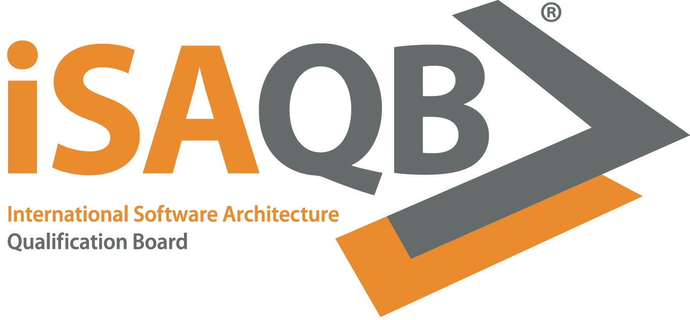

=  Certified Professional for Software Architecture^(R)^ (CPSA)
:TOC: left

// G. Starke <gstarke@isaqb.org>, A. Heusingfeld <aheusingfeld@isaqb.org>, B. Wolf <bwolf@isaqb.org>

The international Software Architecture Qualification Board (link:https://isaqb.org[iSAQB]) defines curricula for software architects.

Here you find links to the respective download areas for the modules.

All repositories are hosted on https://github.com/isaqb-org[Github/isaqb-org] under the https://github.com/isaqb-org[iSAQB organization].

== Foundation Level (CPSA-F)

=== Curriculum
image:https://img.shields.io/github/v/release/isaqb-org/curriculum-foundation["GitHub release"]
image:https://github.com/isaqb-org/curriculum-foundation/workflows/CI/badge.svg?branch=master["Build Status"]
image:https://img.shields.io/github/last-commit/isaqb-org/curriculum-foundation/master.svg["Last commit"]
image:https://img.shields.io/github/contributors/isaqb-org/curriculum-foundation.svg["Contributors",link="https://github.com/isaqb-org/curriculum-foundation/graphs/contributors"]
image:https://img.shields.io/github/issues/isaqb-org/curriculum-foundation.svg["Issues",link="https://github.com/isaqb-org/curriculum-foundation/issues"]
image:https://img.shields.io/github/issues-closed/isaqb-org/curriculum-foundation.svg["Issues closed",link="https://github.com/isaqb-org/curriculum-foundation/issues?utf8=%E2%9C%93&q=is%3Aissue+is%3Aclosed+"]

* https://isaqb-org.github.io/curriculum-foundation[**Foundation Level Documents** (PDF and html))]
* https://github.com/isaqb-org/curriculum-foundation[Source Repository], in case you want to contribute or comment.

=== Examination
image:https://img.shields.io/github/issues/isaqb-org/examination-foundation.svg["Issues",link="https://github.com/isaqb-org/examination-foundation/issues"]
image:https://img.shields.io/github/issues-closed/isaqb-org/examination-foundation.svg["Issues closed",link="https://github.com/isaqb-org/examination-foundation/issues?utf8=%E2%9C%93&q=is%3Aissue+is%3Aclosed+"]

* https://isaqb-org.github.io/examination-foundation/sample_exam/Sample-Exam-Questions-EN.pdf[**Sample Exam Questions**]
* https://isaqb-org.github.io/examination-foundation/sample_exam/Sample-Exam-Answers-EN.pdf[**Sample Exam Answers**]
* https://isaqb-org.github.io/examination-foundation/examination_guide/Examination-Guide-EN.pdf[**Examination Guide**]
* https://github.com/isaqb-org/examination-foundation[Source Repository], in case you want to contribute or comment.

== Advanced Level (CPSA-A)

Please note: currently only those modules already converted to the AsciiDoc build toolchain can be found here, the others are available only via the official https://isaqb.com[iSAQB website].

=== https://isaqb-org.github.io/curriculum-adoc/[ADOC]

**Architecture Documentation**

Transition from docx-based version 1.5/1.6 currently in progress. We will migrate from a purely text-based version to a learning-goal based version.

Please note: the migration is currently (as of September 2020) still unfinished!

image:https://github.com/isaqb-org/curriculum-adoc/workflows/CI/badge.svg?branch=master["Build Status"]
image:https://img.shields.io/github/contributors/isaqb-org/curriculum-adoc.svg["Contributors",link="https://github.com/isaqb-org/curriculum-adoc/graphs/contributors"]
image:https://img.shields.io/github/issues/isaqb-org/curriculum-adoc.svg["Issues",link="https://github.com/isaqb-org/curriculum-adoc/issues"]
image:https://img.shields.io/github/issues-closed/isaqb-org/curriculum-adoc.svg["Issues closed",link="https://github.com/isaqb-org/curriculum-adoc/issues?utf8=%E2%9C%93&q=is%3Aissue+is%3Aclosed+"]

* https://isaqb-org.github.io/curriculum-adoc/[Documents (PDF and html)] 
* https://github.com/isaqb-org/curriculum-adoc[Source Repository]

=== https://isaqb-org.github.io/curriculum-arceval/[ARCEVAL]

**Architecture Evaluation**

image:https://img.shields.io/github/v/release/isaqb-org/curriculum-arceval["GitHub release"]
image:https://github.com/isaqb-org/curriculum-arceval/workflows/CI/badge.svg?branch=master["Build Status"]
image:https://img.shields.io/github/contributors/isaqb-org/curriculum-arceval.svg["Contributors",link="https://github.com/isaqb-org/curriculum-arceval/graphs/contributors"]
image:https://img.shields.io/github/issues/isaqb-org/curriculum-arceval.svg["Issues",link="https://github.com/isaqb-org/curriculum-arceval/issues"]
image:https://img.shields.io/github/issues-closed/isaqb-org/curriculum-arceval.svg["Issues closed",link="https://github.com/isaqb-org/curriculum-arceval/issues?utf8=%E2%9C%93&q=is%3Aissue+is%3Aclosed+"]

* https://isaqb-org.github.io/curriculum-arceval/[Documents (PDF and html)]
* https://github.com/isaqb-org/curriculum-arceval[Source Repository]

=== https://isaqb-org.github.io/curriculum-blockchain/[BLOCKCHAIN]

**Low-Trust Consensus in Decentralized Applications**

image:https://img.shields.io/github/v/release/isaqb-org/curriculum-blockchain["GitHub release"]
image:https://github.com/isaqb-org/curriculum-blockchain/workflows/CI/badge.svg?branch=master["Build Status"]
image:https://img.shields.io/github/contributors/isaqb-org/curriculum-blockchain.svg["Contributors",link="https://github.com/isaqb-org/curriculum-blockchain/graphs/contributors"]
image:https://img.shields.io/github/issues/isaqb-org/curriculum-blockchain.svg["Issues",link="https://github.com/isaqb-org/curriculum-blockchain/issues"]
image:https://img.shields.io/github/issues-closed/isaqb-org/curriculum-blockchain.svg["Issues closed",link="https://github.com/isaqb-org/curriculum-blockchain/issues?utf8=%E2%9C%93&q=is%3Aissue+is%3Aclosed+"]

* https://isaqb-org.github.io/curriculum-blockchain/[Documents (PDF and html)]
* https://github.com/isaqb-org/curriculum-blockchain[Source Repository]

=== https://isaqb-org.github.io/curriculum-flex/[FLEX]

**Flexible Architectures & Microservices**

NOTE: the migrated document 2020.1-rev1 is still in review!

image:https://img.shields.io/github/v/release/isaqb-org/curriculum-flex["GitHub release"]
image:https://github.com/isaqb-org/curriculum-flex/workflows/CI/badge.svg?branch=master["Build Status"]
image:https://img.shields.io/github/contributors/isaqb-org/curriculum-flex.svg["Contributors",link="https://github.com/isaqb-org/curriculum-flex/graphs/contributors"]
image:https://img.shields.io/github/issues/isaqb-org/curriculum-flex.svg["Issues",link="https://github.com/isaqb-org/curriculum-flex/issues"]
image:https://img.shields.io/github/issues-closed/isaqb-org/curriculum-flex.svg["Issues closed",link="https://github.com/isaqb-org/curriculum-flex/issues?utf8=%E2%9C%93&q=is%3Aissue+is%3Aclosed+"]

* https://isaqb-org.github.io/curriculum-flex/[Documents (PDF and html)]
* https://github.com/isaqb-org/curriculum-flex[Source Repository]

---

=== https://isaqb-org.github.io/curriculum-funar/[FUNAR]

**Functional Software Architecture**

Version
include::https://raw.githubusercontent.com/isaqb-org/curriculum-funar/master/document.version[]

//image:https://img.shields.io/github/v/release/isaqb-org/curriculum-funar["GitHub release"]
image:https://github.com/isaqb-org/curriculum-funar/workflows/CI/badge.svg?branch=master["Build Status"]
image:https://img.shields.io/github/contributors/isaqb-org/curriculum-funar.svg["Contributors",link="https://github.com/isaqb-org/curriculum-funar/graphs/contributors"]
image:https://img.shields.io/github/issues/isaqb-org/curriculum-funar.svg["Issues",link="https://github.com/isaqb-org/curriculum-funar/issues"]
image:https://img.shields.io/github/issues-closed/isaqb-org/curriculum-funar.svg["Issues closed",link="https://github.com/isaqb-org/curriculum-funar/issues?utf8=%E2%9C%93&q=is%3Aissue+is%3Aclosed+"]

* https://isaqb-org.github.io/curriculum-funar/[Documents (PDF and html)]
* https://github.com/isaqb-org/curriculum-funar[Source Repository]

=== https://isaqb-org.github.io/curriculum-improve/[IMPROVE] 

**Evolutionary improvement of existing systems**

Version
include::https://raw.githubusercontent.com/isaqb-org/curriculum-improve/master/document.version[]

//image:https://img.shields.io/github/v/release/isaqb-org/curriculum-improve["GitHub release"]
image:https://github.com/isaqb-org/curriculum-improve/workflows/CI/badge.svg?branch=master["Build Status"]
image:https://img.shields.io/github/contributors/isaqb-org/curriculum-improve.svg["Contributors",link="https://github.com/isaqb-org/curriculum-improve/graphs/contributors"]
image:https://img.shields.io/github/issues/isaqb-org/curriculum-improve.svg["Issues",link="https://github.com/isaqb-org/curriculum-improve/issues"]
image:https://img.shields.io/github/issues-closed/isaqb-org/curriculum-improve.svg["Issues closed",link="https://github.com/isaqb-org/curriculum-improve/issues?utf8=%E2%9C%93&q=is%3Aissue+is%3Aclosed+"]

* https://isaqb-org.github.io/curriculum-improve/[Documents (PDF and html)] 
* https://github.com/isaqb-org/curriculum-improve[Source Repository]

=== https://isaqb-org.github.io/curriculum-req4arc/[REQ4ARC]

**Requirements Engineering** for Software Architects

Version
include::https://raw.githubusercontent.com/isaqb-org/curriculum-req4arc/master/document.version[]

// image:https://img.shields.io/github/v/release/isaqb-org/curriculum-req4arc["GitHub release"]
image:https://github.com/isaqb-org/curriculum-req4arc/workflows/CI/badge.svg?branch=master["Build Status"]
image:https://img.shields.io/github/contributors/isaqb-org/curriculum-req4arc.svg["Contributors",link="https://github.com/isaqb-org/curriculum-req4arc/graphs/contributors"]
image:https://img.shields.io/github/issues/isaqb-org/curriculum-req4arc.svg["Issues",link="https://github.com/isaqb-org/curriculum-req4arc/issues"]
image:https://img.shields.io/github/issues-closed/isaqb-org/curriculum-req4arc.svg["Issues closed",link="https://github.com/isaqb-org/curriculum-req4arc/issues?utf8=%E2%9C%93&q=is%3Aissue+is%3Aclosed+"]

* https://isaqb-org.github.io/curriculum-req4arc/[Documents (PDF and html)] 
* https://github.com/isaqb-org/curriculum-req4arc[Source Repository]

=== https://isaqb-org.github.io/curriculum-web/[WEB]

**Web Architectures**

image:https://img.shields.io/github/v/release/isaqb-org/curriculum-web["GitHub release"]
image:https://github.com/isaqb-org/curriculum-web/workflows/CI/badge.svg?branch=master["Build Status"]
image:https://img.shields.io/github/contributors/isaqb-org/curriculum-web.svg["Contributors",link="https://github.com/isaqb-org/curriculum-web/graphs/contributors"]
image:https://img.shields.io/github/issues/isaqb-org/curriculum-web.svg["Issues",link="https://github.com/isaqb-org/curriculum-web/issues"]
image:https://img.shields.io/github/issues-closed/isaqb-org/curriculum-web.svg["Issues closed",link="https://github.com/isaqb-org/curriculum-web/issues?utf8=%E2%9C%93&q=is%3Aissue+is%3Aclosed+"]

* https://isaqb-org.github.io/curriculum-web/[Documents (PDF and html)]
* https://github.com/isaqb-org/curriculum-web[Source Repository]

=== https://isaqb-org.github.io/curriculum-websec/[WEBSEC]

**Web Security**

image:https://img.shields.io/github/v/release/isaqb-org/curriculum-websec["GitHub release"]
image:https://github.com/isaqb-org/curriculum-websec/workflows/CI/badge.svg?branch=master["Build Status"]
image:https://img.shields.io/github/contributors/isaqb-org/curriculum-websec.svg["Contributors",link="https://github.com/isaqb-org/curriculum-websec/graphs/contributors"]
image:https://img.shields.io/github/issues/isaqb-org/curriculum-websec.svg["Issues",link="https://github.com/isaqb-org/curriculum-websec/issues"]
image:https://img.shields.io/github/issues-closed/isaqb-org/curriculum-websec.svg["Issues closed",link="https://github.com/isaqb-org/curriculum-websec/issues?utf8=%E2%9C%93&q=is%3Aissue+is%3Aclosed+"]

* https://isaqb-org.github.io/curriculum-websec/[Documents (PDF and html)]
* https://github.com/isaqb-org/curriculum-websec[Source Repository]
